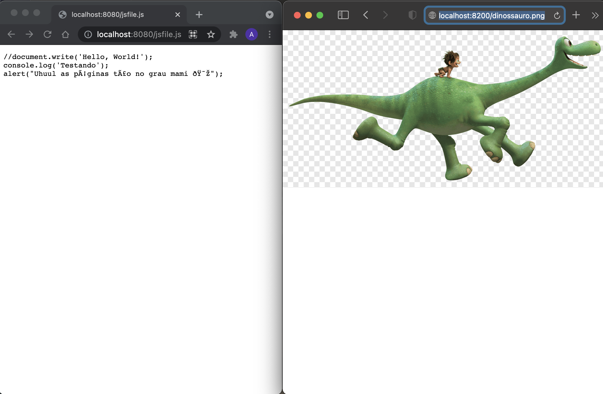

# WebProg--Trabalho-1---PUC-Rio
## Trabalho 1 da disciplina de Programação para a Web na PUC-Rio
### Professor Alexandre Meslin
### Aluna Ana Luiza F. V. Peixoto - Matrícula 1611278

## Descrição

Um Servidor Web simples em que recebe requisições do tipo GET. (Não usa classes ou módulos HTTP). O programa se utiliza de um fork() para poder atender clientes simultaneamente.  

## Como usar

 Para utilizar o código é necessário ter o python3 instalado na sua máquina. O código pode ser usado em qualquer IDE que rode Python (VSCode configurada pra Python, PyCharm, Atom e etc.). Após abrir o projeto no seu editor e mandar debuggar o código, você pode testar as requisições pelo navegador. O código está configurado para abrir receber as requisições no endereço localhost:8080. Para testar as requisiçõs é apenas chamar o nome do arquivo após o portão.  

  
> Ex:  localhost:8080/doguinho.jpeg

## O que funcionou

 Através da barra do navegador, eu consegui fazer o request pra acessar os arquivos em .jpeg, .gif, .png, .js (em forma de texto) . A página erro.html aparecia quando o nome do arquivo não era encontrato e a página index.html está como default . Testei usar o sleep e consegui abrir as páginas em diferentes abas e diferentes navegadores 

 
 ## Erro
 
 
 Está dando um erro OSError: Bad File Descriptor na linha do "request = connection.recv(4096).decode("utf-8")". Pelo que eu pesquisei provavelmente é um erro no lugar que eu to fazendo o con.close( ) (fechando a conexão). No entanto, não consegui concertar.

 

 O arquivo .jpeg eu só consegui abrir quando escrevia a extensão dessa forma. Quando eu escrevi ".jpg" apareceu a página 404 - Not found 

 
 ## Não implementado
 
 
Uma das exigências do trabalho não foi cumprida:

 
 >_"Uma lista de arquivos default, ou seja, se o pedido chegar sem nome de arquivo, o seu programa deverá procurar por arquivos nessa lista, na ordem, antes de enviar erro 404 (página não encontrada)."_ 
 
 Ao invés de pecorrer esses arquivos default, o programa vai até a página _index.html_
 
 
  
